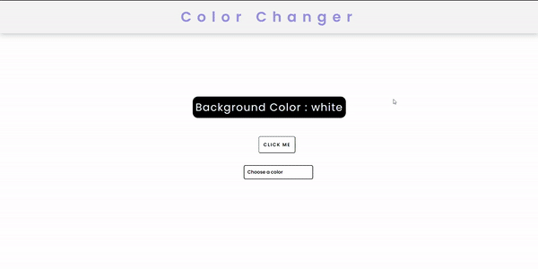

# Colour Changer
A javascript application that changes the background color of the webpage to random color on click or user can specify a color of their choice.  

## Languages Used:  
>>HTML
>>CSS
>>JAVASCRIPT

# DEMO  
  
>   
 
 
 
 Link to website: https://nitinshaily.github.io/BG-color-changer/  
